#— IMA Processor V3 (Enterprise)

> **Full enterprise compliance pipeline — 20 nodes covering ALL codiebyheart node types for 150–200 page IMA documents**

---

## What It Does

V3 is the enterprise upgrade of V2. It adds:
- **3-chunk parallel processing** for large documents (150–200 pages)
- **Document type routing** via a Switch node (IMA vs Mandate vs Other)
- **Conflict & gap detection** between clauses
- **MCP-powered compliance verification** (codiebyheart Compliance MCP)
- **5-tile interactive dashboard** (Preview node)
- All processing in parallel where possible

---

## Full Flow Diagram

```mermaid
flowchart LR
    START([▶ Start]) --> UI

    UI[📋 Client Intake Form\nui] --> PDF

    PDF[📄 Enterprise PDF Chunker\nscript/nodejs] --> INTEL

    INTEL[🧠 Document Intelligence\nllm] --> EXTRACT

    EXTRACT[🔍 DocType Extractor\nscript/nodejs] --> SW

    SW{🔀 Document Type Router\nswitch}

    SW -- IMA --> SEC
    SW -- default --> SIMPLE

    SIMPLE[⚡ Mandate Quick Processor\nllm] --> END

    SEC[🗺️ IMA Section Mapper\nllm] --> CLAUSE

    CLAUSE[⚖️ Master Clause Extractor\nllm\nall 3 chunks] --> CONFLICT

    CONFLICT[⚠️ Conflict & Gap Detector\nllm] --> REPEAT

    REPEAT[🔄 Parallel Risk Processor\nrepeat × 3 parallel]

    REPEAT --> CHILD[🚦 Batch Risk Analyser\nllm — child node]
    CHILD --> REPEAT

    REPEAT --> AGG

    AGG[📊 Risk Aggregator\nllm] --> MCP

    MCP[🔌 codiebyheart Compliance MCP\nmcp-tools] --> AGENT

    AGENT[🤖 Compliance Verification Agent\nagent-custom] --> REG

    REG[📜 Regulatory Cross-Reference\nllm\nMIFID II / FCA / AIFMD / SEC] --> RULES

    RULES[💻 Rule Engine Coder\nllm\nBLOCK / ALERT / WARN] --> SUMMARY

    SUMMARY[📝 Executive Summary Pro\nllm] --> PREVIEW

    PREVIEW[🖥️ IMA Intelligence Dashboard\npreview — 5 tiles] --> END([⏹ End])
```



---

## Node Inventory (All 20 Nodes)

| # | Label | Type | Why Used |
|---|-------|------|----------|
| 1 | Start | `control-start` | Entry point |
| 2 | **Client Intake Form** | `ui` | Collects 7 inputs: client name, portfolio ID, mandate date, jurisdiction, reviewer name, PDF file, processing mode |
| 3 | **Enterprise PDF Chunker** | `script` (nodejs) | V2's proven PDF extraction base + splits text into 3 equal chunks (chunk1/2/3) for parallel downstream processing. `data.type = "nodejs"` required! |
| 4 | **Document Intelligence** | `llm` | Classifies document type (IMA / Mandate / SideLetterOrOther), identifies parties, jurisdiction, effective date |
| 5 | **DocType Extractor** | `script` (nodejs) | Parses the JSON from Document Intelligence and returns a clean `"IMA"` or `"default"` string for the Switch node to match against |
| 6 | **Document Type Router** | `switch` | Routes IMA documents to the full pipeline, everything else to the quick processor. Uses `options: "IMA,default"` |
| 7 | **Mandate Quick Processor** | `llm` | Fast 2-minute scan for non-IMA documents (Mandates, Side Letters). Goes straight to End |
| 8 | **IMA Section Mapper** | `llm` | Maps all 18+ IMA sections with page ranges and priority levels |
| 9 | **Master Clause Extractor** | `llm` | Reads all 3 chunks simultaneously to extract every clause across the full document |
| 10 | **Conflict & Gap Detector** | `llm` | Finds internal contradictions between clauses (e.g., two conflicting concentration limits) and regulatory gaps |
| 11 | **Parallel Risk Processor** | `repeat` | Runs 3 iterations in parallel (`i < 3, isparallel: true`). Each iteration processes one chunk batch. Output collected in `data.items[]` |
| 12 | **Batch Risk Analyser** | `llm` | Child node inside the repeat. Processes one batch of clauses per iteration. Tagged with regulatory frameworks (MIFID II, FCA COBS, AIFMD, SEC) |
| 13 | **Risk Aggregator** | `llm` | Merges all 3 parallel batches from `{{Parallel Risk Processor[data.items]s}}` into one consolidated risk report |
| 14 | **codiebyheart Compliance MCP** | `mcp-tools` | Connects to `https://codiebyheart-mcp.dev.pscodiebyheart.live/mcp/compliance_mcp`. Tools: `fact_check`, `pii_check`, `ban_topics_check`, `sentiment_check` |
| 15 | **Compliance Verification Agent** | `agent-custom` | Uses the MCP tools autonomously to verify facts, detect PII, check for restricted topics. Connected to MCP via `tools` edge handle |
| 16 | **Regulatory Cross-Reference** | `llm` | Maps each clause to MIFID II articles, FCA COBS rules, AIFMD provisions, SEC IA Act requirements |
| 17 | **Rule Engine Coder** | `llm` | Generates executable rules: `IF [condition] THEN BLOCK/ALERT/WARN` with parameters for Fund Designer compliance engine |
| 18 | **Executive Summary Pro** | `llm` | Board-ready report using ALL upstream data via explicit node references |
| 19 | **IMA Intelligence Dashboard** | `preview` | 5 tiles: Executive Summary / Risk Scorecard / Regulatory Compliance / Coded Rules / Compliance Verification |
| 20 | End | `control-end` | Exit point |

---

## Node Types — Why Each One Exists

### `ui` — Form Input
The only way to get user input (file + text fields) before the workflow runs. All fields are referenced downstream as `{{Client Intake Form[data.response["fieldName"]]s}}`.

### `script` (nodejs)
Used where LLMs can't help — binary file reading, JSON parsing, text splitting. **Critical:** must have `"data.type": "nodejs"` or codiebyheart defaults to bash (common V3 bug!).

### `llm`
Core processing engine. Each LLM does one focused job. Model: `claude-sonnet-4-5@20250929`. All prompts use explicit variable references — never ambiguous `{{response}}`.

### `switch`
Routes workflow based on a value. `options: "IMA,default"` — the condition value must match an option EXACTLY. Needed a DocType Extractor script to parse the LLM's JSON first.

### `repeat` with `isparallel: true`
Runs child nodes multiple times in parallel. Child node sits INSIDE the repeat bounding box in the canvas. Outputs are collected in `data.items[]` array. Condition: `i < 3`.

### `mcp-tools`
Connects to an external MCP server. Provides tools to the agent-custom node. Edge must use `targetHandle: "tools"` to connect to agent's tools input.

### `agent-custom`
An autonomous agent that decides WHICH MCP tools to call and in what order. More powerful than a single LLM — can chain multiple tool calls. Output at `data.result.response`.

### `preview`
5-tile result dashboard shown after workflow completes. Each tile references a specific upstream node. `displayType: "text"` works for markdown output.

---

## Critical Lessons Learned (V2 → V3)

| Issue | Root Cause | Fix |
|-------|-----------|-----|
| Script runs as bash instead of Node.js | `data.type: "nodejs"` missing from script node | Add `"type": "nodejs"` inside `data` object |
| Switch condition always fails | LLM outputs full JSON, switch needs plain string | Add DocType Extractor script to parse JSON first |
| `if-else` always errors | codiebyheart bug — condition evaluator broken | Remove if-else, use `switch` instead |
| Variables show as `{{varName}}` in output | No variable exists with that name in scope | Use `{{NodeLabel[data.path]s}}` syntax |
| `date` / `select` UI fields cause load failure | Field types not supported in this codiebyheart version | Use `text` for all field types |
| Duplicate switch edges | Two edges same source→target | Keep one, make it the `default` route |
| Backward repeat edge | Manually added child→parent edge | Remove — repeat auto-collects child output |
| All 10 LLM nodes missing output field | `data.output` not set | Copy output schema from working V2 node |

---

## Variable Reference Cheat Sheet

```
# UI fields
{{Client Intake Form[data.response["clientName"]]s}}
{{Client Intake Form[data.response["imaFile"]]s}}

# LLM output
{{Document Intelligence[data.response]s}}
{{Risk Aggregator[data.response]s}}

# Agent-custom output
{{Compliance Verification Agent[data.result.response]s}}

# Script output (parsed JSON field)
{{Enterprise PDF Chunker[data.response.chunk1]s}}
{{DocType Extractor[data.response.docType]s}}

# Repeat items array
{{Parallel Risk Processor[data.items]s}}
```

---

## What V3 Achieves vs V2

| Capability | V2 | V3 |
|-----------|----|----|
| Document size | Any | Optimised for 150-200 pages (3-chunk split) |
| Document routing | No | Switch: IMA vs Mandate vs Other |
| Conflict detection | No | Yes — internal contradictions + gaps |
| Parallel processing | No | Yes — 3 parallel risk batches |
| MCP integration | No | Yes — codiebyheart Compliance MCP |
| Autonomous agent | No | Yes — Compliance Verification Agent |
| Regulatory mapping | Basic | MIFID II / FCA COBS / AIFMD / SEC |
| Results dashboard | No | Yes — 5-tile Preview |
| Node types covered | 4 | All 9 codiebyheart node types |

---

## How to Run

1. Import `workflow-Guideline_IQ_IMA_Processor_v3.json` into codiebyheart
2. Click **Run**
3. Fill in the **Client Intake Form** (7 fields):
   - Client Name, Portfolio ID, Mandate Date, Jurisdiction, Reviewer Name
   - Upload `sample-ima-test.pdf` in the **imaFile** field
   - Processing Mode: `full`
4. Wait ~10-15 minutes for full enterprise analysis
5. View the **IMA Intelligence Dashboard** (5 tiles)

---

## Files

| File | Purpose |
|------|---------|
| `workflow-Guideline_IQ_IMA_Processor_v3.json` | Import into codiebyheart |
| `build_v3.py` | Python generator script (regenerates the JSON) |
| `fix_v3.py`, `fix_v3b.py`, `fix_v3c.py` | Fix scripts applied during debugging |
| `sample-ima-test.pdf` | Test PDF (20-clause IMA) |
| `samples/` | Reference codiebyheart workflow examples for all node types |
